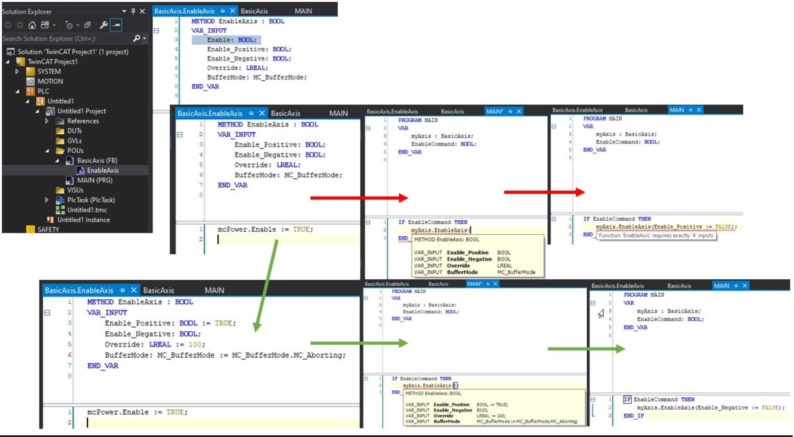
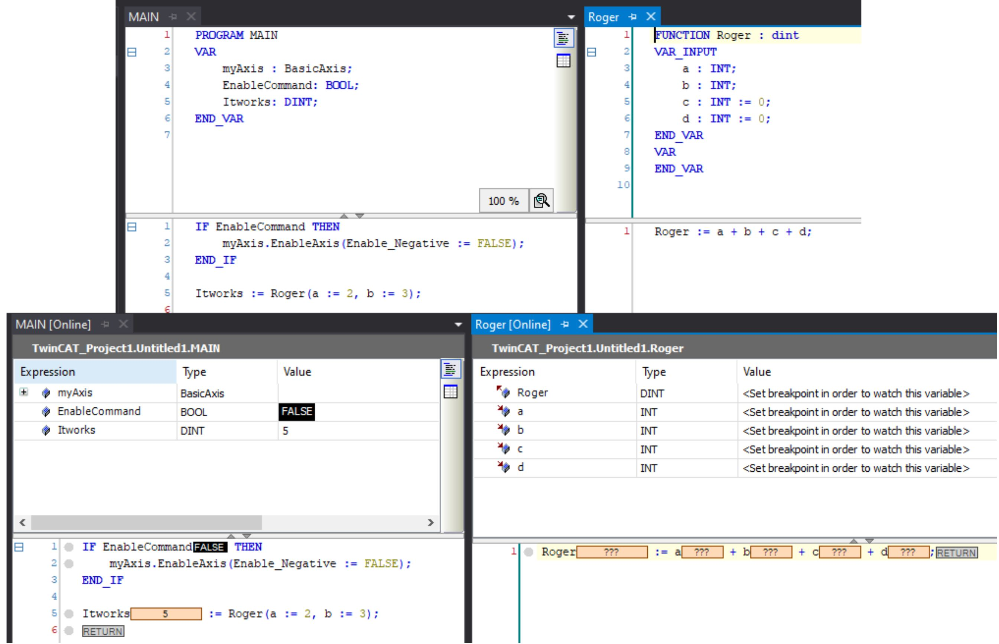
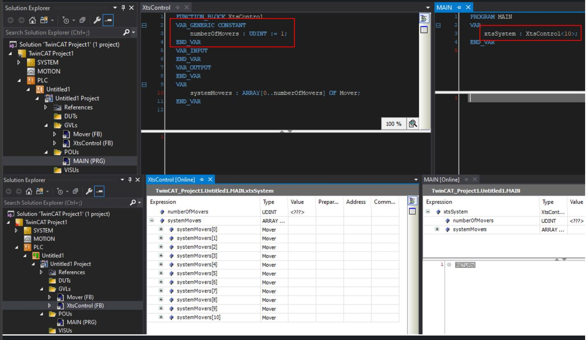

### Variable types and special variables:

The variable type defines how and where you can use the variable. The variable type is defined during the variable declaration.

### Further Information:
- [Local Variables - VAR](https://infosys.beckhoff.com/content/1033/tc3_plc_intro/2528755083.html)
    - Las variables locales se declaran en la parte de declaración de los objetos de programación entre las palabras clave VAR y END_VAR.
    - Puede extender las variables locales con una palabra clave de atributo.
    - Puede acceder a variables locales para leer desde fuera de los objetos de programación a través de la ruta de instancia. El acceso para escribir desde fuera del objeto de programación no es posible; Esto será mostrado por el compilador como un error.
    - Para mantener la encapsulación de datos prevista, se recomienda encarecidamente no acceder a las variables locales de un POU desde fuera del POU, ni en modo de lectura ni en modo de escritura. (Otros compiladores de lenguaje de alto nivel también generan operaciones de acceso de lectura a variables locales como errores). Además, con los bloques de funciones de biblioteca no se puede garantizar que las variables locales de un bloque de funciones permanezcan sin cambios durante las actualizaciones posteriores. Esto significa que es posible que el proyecto de aplicación ya no se pueda compilar correctamente después de la actualización de la biblioteca.
    - También observe aquí la regla SA0102 del Análisis Estático, que determina el acceso a las variables locales para la lectura desde el exterior.
- [Input Variables - VAR_INPUT](https://infosys.beckhoff.com/content/1033/tc3_plc_intro/2528760459.html)
    - Las variables de entrada son variables de entrada para un bloque de funciones.
    - VAR_INPUT variables se declaran en la parte de declaración de los objetos de programación entre las palabras clave VAR_INPUT y END_VAR.
    - Puede ampliar las variables de entrada con una palabra clave de atributo.
    - En TwinCAT build 4026 existe la sobrecarga de las VAR_INPUT, en su declaración se podrán incializar las variables declaradas de esta forma al llamar al FB, FC, metodo, etc..., no es obligatorio incluirla en la llamada ya que tendrán el valor por defecto si no se llama en su modulo correspondiente.

    

    

- [Output Variables - VAR_OUTPUT](https://infosys.beckhoff.com/content/1033/tc3_plc_intro/2528765835.html)
    - Las variables de salida son variables de salida de un bloque de funciones.
    - VAR_OUTPUT variables se declaran en la parte de declaración de los objetos de programación entre las palabras clave VAR_OUTPUT y END_VAR. TwinCAT devuelve los valores de estas variables al bloque de función de llamada. Allí puede consultar los valores y continuar usándolos.
    - Puede ampliar las variables de salida con una palabra clave de atributo.    
- [Input/Output Variables - VAR_IN_OUT, VAR_IN_OUT CONSTANT](https://infosys.beckhoff.com/content/1033/tc3_plc_intro/2528771211.html)
- [Global Variables - VAR_GLOBAL](https://infosys.beckhoff.com/content/1033/tc3_plc_intro/2528776587.html)
    - Solo es posible su declaración en GVL (Lista de Variables Global)
- [Temporary Variable - VAR_TEMP](https://infosys.beckhoff.com/content/1033/tc3_plc_intro/2528781963.html)
    - Esta funcionalidad es una extensión con respecto a la norma IEC 61131-3.
    - Las variables temporales se declaran localmente entre las palabras clave VAR_TEMP y END_VAR.
    - VAR_TEMP declaraciones sólo son posibles en **programas y bloques de funciones.**
    - TwinCAT reinicializa las variables temporales cada vez que se llama al bloque de funciones.
    - La aplicación sólo puede acceder a variables temporales en la parte de implementación de un programa o bloque de funciones.
- [Static Variables - VAR_STAT](https://infosys.beckhoff.com/content/1033/tc3_plc_intro/2528787339.html)
    - Esta funcionalidad es una extensión con respecto a la norma IEC 61131-3.
    - Las variables estáticas se declaran localmente entre las palabras clave VAR_STAT y END_VAR. TwinCAT inicializa las variables estáticas cuando se llama por primera vez al bloque de funciones respectivo.
    - Puede tener acceso a las variables estáticas sólo dentro del espacio de nombres donde se declaran las variables (como es el caso de las variables estáticas en C). Sin embargo, las variables estáticas conservan su valor cuando la aplicación sale del bloque de funciones. Puede utilizar variables estáticas, como contadores para llamadas a funciones, por ejemplo.
    - Puede extender variables estáticas con una palabra clave de atributo.
    - Las variables estáticas solo existen una vez. Esto también se aplica a las variables estáticas de un bloque de funciones o un método de bloque de funciones, incluso si el bloque de funciones se instancia varias veces.
- [External Variables - VAR_EXTERNAL](https://infosys.beckhoff.com/content/1033/tc3_plc_intro/2528792715.html)
    - Las variables externas son variables globales que se "importan" en un bloque de funciones.
    - Puede declarar las variables entre las palabras clave VAR_EXTERNAL y END_VAR. Si la variable global no existe, se emite un mensaje de error.	
    - En TwinCAT 3 PLC no es necesario que las variables se declaren como externas. La palabra clave existe para mantener la compatibilidad con IEC 61131-3.
    - Si, no obstante, utiliza variables externas, asegúrese de abordar las variables asignadas (con AT %I o AT %Q) sólo en la lista global de variables. El direccionamiento adicional de las instancias de variables locales daría lugar a duplicaciones en la imagen del proceso.
    - Estas variables declaradas tambien tiene que estar declarada la misma variable con el mismo nombre en una GVL (Lista de Varaibles Global)
- [Instance Variables - VAR_INST](https://infosys.beckhoff.com/content/1033/tc3_plc_intro/2528798091.html)
    - TwinCAT crea una variable VAR_INST de un método no en la pila de métodos como las variables VAR, sino en la pila de la instancia del bloque de funciones. Esto significa que la variable VAR_INST se comporta como otras variables de la instancia del bloque de función y no se reinicializa cada vez que se llama al método.
    - VAR_INST variables solo están permitidas en los métodos de un bloque de funciones, y el acceso a dicha variable solo está disponible dentro del método. Puede supervisar los valores de las variables de instancia en la parte de declaración del método.
    - Las variables de instancia no se pueden extender con una palabra clave de atributo.
- [Remanent Variables - PERSISTENT, RETAIN](https://infosys.beckhoff.com/content/1033/tc3_plc_intro/2528803467.html)
Las variables remanentes pueden conservar sus valores más allá del tiempo de ejecución habitual del programa. Las variables remanentes se pueden declarar como variables RETAIN o incluso más estrictamente como variables PERSISTENTES en el proyecto PLC.

Un requisito previo para la funcionalidad completa de las variables RETAIN es un área de memoria correspondiente en el controlador (NovRam). Las variables persistentes se escriben solo cuando TwinCAT se apaga. Esto requerirá generalmente un UPS correspondiente. Excepción: Las variables persistentes también se pueden escribir con el bloque de función FB_WritePersistentData.

Si el área de memoria correspondiente no existe, los valores de las variables RETAIN y PERSISTENT se pierden durante un corte de energía.
	
La declaración AT no debe utilizarse en combinación con VAR RETAIN o VAR PERSISTENT.
### Variables persistentes
Puede declarar variables persistentes agregando la palabra clave PERSISTENT después de la palabra clave para el tipo de variable (VAR, VAR_GLOBAL, etc.) en la parte de declaración de los objetos de programación.

Las variables PERSISTENTES conservan su valor después de una terminación no controlada, un Reset cold o una nueva descarga del proyecto PLC.
Cuando el programa se reinicia, el sistema continúa funcionando con los valores almacenados. En este caso, TwinCAT reinicializa las variables "normales" con sus valores iniciales especificados explícitamente o con las inicializaciones predeterminadas.
En otras palabras, TwinCAT solo reinicializa las variables PERSISTENTES durante un origen de Restablecer.

Un ejemplo de aplicación para variables persistentes es un contador de horas de funcionamiento, que debe continuar contando después de un corte de energía y cuando el proyecto PLC se descarga nuevamente.

Evite usar el tipo de datos POINTER TO en listas de variables persistentes, ya que los valores de dirección pueden cambiar cuando el proyecto PLC se descargue nuevamente. TwinCAT emite las advertencias correspondientes del compilador.
Declarar una variable local como PERSISTENTE en una función no tiene ningún efecto. La persistencia de datos no se puede utilizar de esta manera.
El comportamiento durante un restablecimiento en frío puede verse influenciado por el pragma 'TcInitOnReset'
***
### Variables RETAIN
Puede declarar variables RETAIN agregando la palabra clave RETAIN después de la palabra clave para el tipo de variable (VAR, VAR_GLOBAL, etc.) en la parte de declaración de los objetos de programación.

Las variables declaradas como RETAIN dependen del sistema de destino, pero normalmente se administran en un área de memoria separada que debe protegerse contra fallas de energía. El llamado controlador Retain asegura que las variables RETAIN se escriban al final de un ciclo PLC y solo en el área correspondiente de la NovRam. El manejo del controlador de retención se describe en el capítulo "Conservar datos" de la documentación de C/C++.

Las variables RETAIN conservan su valor después de una terminación incontrolada (corte de energía). Cuando el programa se reinicia, el sistema continúa funcionando con los valores almacenados. En este caso, TwinCAT reinicializa las variables "normales" con sus valores iniciales especificados explícitamente o con las inicializaciones predeterminadas.
TwinCAT reinicializa las variables RETAIN en un origen de restablecimiento.

Una posible aplicación es un contador de piezas en una planta de producción, que debe seguir contando después de un corte de energía.

Si declara una variable local como RETAIN en un programa o bloque de funciones, TwinCAT almacena esta variable específica en el área de retención (como una variable RETEAIN global).
Si declara una variable local en una función como RETAIN, esto no tiene efecto. TwinCAT no almacena la variable en el área de retención.

### Cuadro general completo
El grado de retención de las variables RETAIN se incluye automáticamente en el de las variables PERSISTENT.

| **Después del comando en línea**  | **VAR**  | **VAR RETAIN** | **VAR PERSISTENT** |
|:------------- |:----------------| :-------------| :-------------|
| Restablecer frío         | Los valores se reinicializan | Los valores se mantienen       | Los valores se mantienen     |
| Restablecer origen       | Los valores se reinicializan | Los valores se reinicializan   | Los valores se reinicializan |
| Descargar                | Los valores se reinicializan | Los valores se mantienen       | Los valores se mantienen     |
| Cambio en línea          | Los valores se mantienen     | Los valores se mantienen       | Los valores se mantienen     |

***
- [SUPER](https://infosys.beckhoff.com/content/1033/tc3_plc_intro/2528837771.html)
- [THIS](https://infosys.beckhoff.com/content/1033/tc3_plc_intro/2528843147.html)
- [Variable types - attribute keywords](https://infosys.beckhoff.com/content/1033/tc3_plc_intro/2528848523.html)
    - [RETAIN: for remanent variables of type RETAIN](https://infosys.beckhoff.com/content/1033/tc3_plc_intro/2528803467.html)
    - [PERSISTENT: for remanent variables of type PERSISTENT](https://infosys.beckhoff.com/content/1033/tc3_plc_intro/2528803467.html)
    - [CONSTANT: for constants](https://infosys.beckhoff.com/content/1033/tc3_plc_intro/2529284235.html#2529371275)
    - [VAR_GENERIC CONSTANT](https://content.helpme-codesys.com/en/CODESYS%20Development%20System/_cds_vartypes_var_generic_constant.html#:~:text=A%20generic%20constant%20is%20a,function%20block%20instance%20is%20assigned.)
    - En la versión de TwinCAT build 4026: podremos declarar VAR_GENERIC CONSTANT ver imagen adjunta:
 
***

https://github.com/runtimevic/OOP-IEC61131-3--Curso-Youtube/issues/13
### VAR_INST:

VAR_INST inside of a method call is the same as putting the variable in a VAR in the Function Block. Method variables are destroyed at the end of a method call, where as Function Block variables are destroyed only when the Function Block is destroyed.

I personally do not use VAR_INST when doing OOP programming, as I feel that VAR in the body of the function block is easier to read and understand.

### VAR_STAT:

Static variables. As we know, Function blocks (and Classes) instantiate and hold a collection of variable for themselves. As an example, we can have many TON function blocks which all run independent of each other as their variables are separate.

If you declare a variable as VAR_STAT, you make it static. At that point, all function blocks of the same type will share this variable. If one of the instantiated function blocks writes to it, all of the other function blocks of the same type will see this change. Its a common variable among instances. So. VAR is local, only accessible by the function block. VAR_STAT is common across all instances of a function block.
***
### Links:
- 🔗 [Local Variables - VAR, infosys.beckhoff.com/](https://infosys.beckhoff.com/english.php?content=../content/1033/tc3_plc_intro/2528755083.html&id=)

- 🔗 [Instance Variables - VAR_INST, infosys.beckhoff.com/](https://infosys.beckhoff.com/english.php?content=../content/1033/tc3_plc_intro/2528798091.html&id=)

- 🔗 [www.plccoder.com/instance-variables-with-var_inst](https://www.plccoder.com/instance-variables-with-var_inst/)

- 🔗 [www.plccoder.com/var_temp-var_stat-and-var_const](https://www.plccoder.com/var_temp-var_stat-and-var_const/)

- 🔗 [Tipos de variables y variables especiales](https://infosys.beckhoff.com/content/1033/tc3_plc_intro/2528749707.html?id=3782076432056683724)
