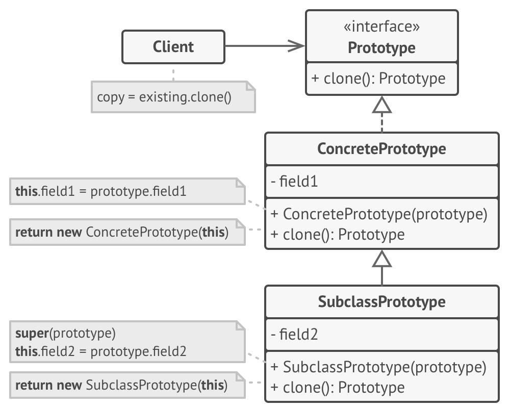
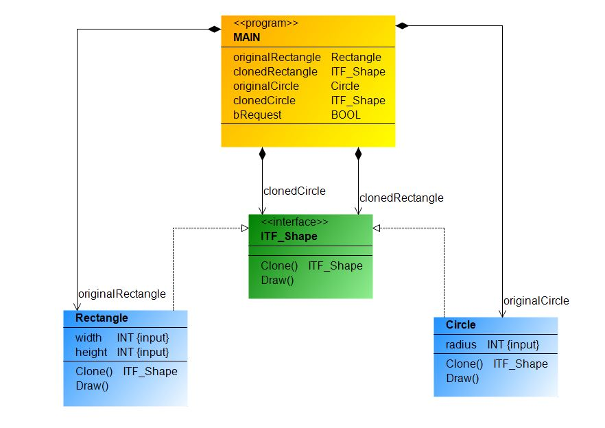

- 👉[**Prototipo**](https://refactoring.guru/design-patterns/prototype) es un patrón de diseño creacional que le permite copiar objetos existentes sin que su código dependa de sus clases, si los atributos son privados no se podran copiar tal cual.
- Duplicamos objetos a partir de unos que ya tenemos.
- El proceso de clonación se delega a los propios objetos objetos prototipos que estan siendo clonados.
- Para ello se realiza a partir de una interface o clase abstracta, las clases prototipo implementan la inteface, por lo tanto estan obligadas a implementar los metodos y propiedades de la interface, en la interface añadimos un metodo llamado clonar que sera el encargado de devolver el propio objeto, con esto conseguimos no tener la neceseidad de acoplar la logica de clonación de las clases lo tendremos desacoplado.
- Este patrón es util cuando crear objetos sea muy costoso en terminos de tiempo y de recursos, o que los objetos tienen una estructura compleja que sea dificil de replicar con constructores, también cuando queremos un objeto configurado de una manera especifica con configuracions similares.
- Utilice el patrón de prototipo si desea crear un objeto con los mismos valores de propiedad de otro objeto existente.

El diagrama de clases UML del Patrón Creacional Prototipo es el siguiente:

***
Implementación del patrón de Diseño Creacional Prototipo, ejemplo practico en TwinCAT 3:

***
### Links de Patrones de Diseño Prototipo:
- 🔗 [softwareparticles.com, design-patterns-prototype](https://softwareparticles.com/design-patterns-prototype/)

- 🔗 [0w8States/PLC-Design-Patterns](https://github.com/0w8States/PLC-Design-Patterns)

- 🔗 [refactoring.guru, prototype](https://refactoring.guru/design-patterns/prototype)

- 🔗 [Aprende los principales patrones de diseño con .NET y C#. Patron Prototype](https://www.youtube.com/watch?v=5-abb_iV3ac)

***
### Link al Video de Youtube_38:
- 🔗 [Prototype Design Pattern Youtube]()