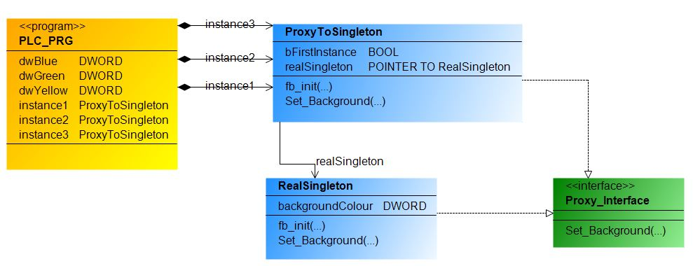

- 👉[**Singleton**](https://refactoring.guru/design-patterns/singleton) es un patrón de diseño creacional que le permite garantizar que una clase tenga solo una instancia, al tiempo que proporciona un punto de acceso global a esta instancia.

El diagrama de clases UML del Patrón Creacional Singleton es el siguiente:

- La clase Singleton declara el método estático getInstance que devuelve la misma instancia de su propia clase.

- El constructor de Singleton debe estar oculto en el código del cliente. Llamar al getInstance método debería ser la única forma de obtener el objeto Singleton.
***
Implementación de Singleton ejemplo practico en TwinCAT 3:

***
### Links de Patrones de Diseño Singleton:
- 🔗 [github.com,Aliazzzz,Applied-Design-Patterns-in-CODESYS-V3](https://github.com/Aliazzzz/Applied-Design-Patterns-in-CODESYS-V3)

- 🔗 [refactoring.guru, singleton](https://refactoring.guru/design-patterns/singleton)
***
### Link al Video de Youtube_39:
- 🔗 [Singleton Design Pattern Youtube]()